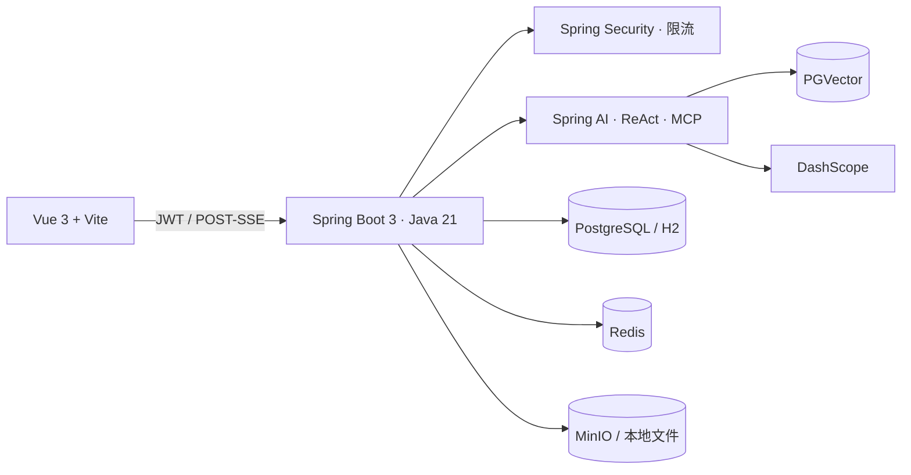

# HeartPilot

> 面向关系成长场景的 AI 助手：把倾诉、分析、行动规划、用户确认与持续复盘，串成一条可追踪的成长闭环。

HeartPilot 是一个前后端分离的全栈 AI 应用。项目基于 Spring AI、RAG、Tool Calling、MCP 与 ReAct 构建，并补充了多用户数据隔离、持久化任务编排、执行轨迹、用量成本统计和 Vue 3 前端。

**快速导航：** [核心能力](#功能概览) · [技术架构](#技术架构) · [本地运行](#本地开发推荐) · [Docker 部署](#docker-compose) · [配置说明](#配置说明) · [测试](#验证与质量检查)

> [!IMPORTANT]
> 当前版本已覆盖核心业务路径并支持重复构建，但尚未完成生产容量压测、故障演练和系统化 AI 效果评测，不应据此宣称生产级高可用。

## 功能概览

| 模块 | 能力 |
| --- | --- |
| 账户与档案 | 注册登录、JWT 鉴权、角色控制、关系档案与情绪状态 |
| AI 咨询 | 会话持久化、POST-SSE 流式输出、停止/重新生成、上下文窗口与用量记录 |
| 关系报告 | 结构化分析、风险等级、行动清单、复盘建议与中文 PDF 导出 |
| 行动规划 Agent | 可恢复状态机、SSE 阶段推送、工具审计、确认/取消、失败重试和最终 PDF |
| 执行轨迹 | Thought / Action / Observation / Result 持久化；首次提交及每次重新规划均生成独立、默认折叠的执行分支 |
| 成长闭环 | 关系事件、7 天行动计划、每日打卡、情绪记录和周复盘 |
| 知识库 | 管理员上传 Markdown、TXT、PDF、Word；解析、切片、Embedding、PGVector 检索和引用展示 |

## 技术架构



本地开发默认使用文件型 H2 和本地文件存储，无需先安装 PostgreSQL、Redis 或 MinIO。生产容器使用 PostgreSQL、Redis 与 MinIO。

## 快速开始

### 环境要求

- JDK 21
- Node.js 20 LTS 或更高版本、npm
- Docker Desktop（仅 Docker 方式需要）
- DashScope API Key（仅实际调用 AI 能力需要）

### 本地开发（推荐）

1. 在项目根目录复制环境变量模板：

   ```powershell
   Copy-Item .env.example .env
   ```

2. 至少设置 `DASHSCOPE_API_KEY`；首次本地调试建议保持 `MCP_ENABLED=false`，避免外部 MCP 服务影响启动。

3. 启动后端：

   ```powershell
   .\mvnw.cmd spring-boot:run
   ```

4. 新开一个终端，启动前端：

   ```powershell
   cd heart-pilot-frontend
   npm ci
   npm run dev
   ```

5. 打开以下地址：

   | 服务 | 地址 |
   | --- | --- |
   | 前端 | http://localhost:3001 |
   | 后端健康检查 | http://localhost:8123/api/health |
   | 接口文档 | http://localhost:8123/api/swagger-ui.html |
   | Prometheus 指标 | http://localhost:8123/api/actuator/prometheus |

> [!NOTE]
> H2 是单进程文件数据库。同一份 `data/heart-pilot` 只能被一个后端进程打开；若再次启动报 JDBC Dialect 或数据库元数据错误，请先关闭已运行的后端实例。

### Docker Compose

1. 复制并填写 `.env`：

   ```powershell
   Copy-Item .env.example .env
   ```

2. 修改至少以下敏感配置：`JWT_SECRET`、`DATABASE_PASSWORD`、`MINIO_SECRET_KEY`、`APP_ADMIN_PASSWORD`。按需填写 `DASHSCOPE_API_KEY`、`SEARCH_API_KEY` 和 `AMAP_MAPS_API_KEY`。

3. 启动：

   ```bash
   docker compose up --build
   ```

4. 前端默认访问 `http://localhost:8081`，MinIO 控制台为 `http://localhost:9001`。

## 配置说明

`.env` 不应提交到 Git；可参考 `.env.example`。常用变量如下：

| 变量 | 用途 | 本地建议 |
| --- | --- | --- |
| `DASHSCOPE_API_KEY` | DashScope 对话与 Embedding | 配置真实 Key 才能调用 AI |
| `MCP_ENABLED` | 是否启用高德 MCP | 首次本地启动设为 `false` |
| `AGENT_REACT_ENABLED` | 是否启用 ReAct 调研链路 | 默认 `true` |
| `DATABASE_URL` | 数据库连接 | 留空即使用本地 H2 |
| `REDIS_ENABLED` | Redis 缓存与限流 | 本地可设为 `false` |
| `STORAGE_PROVIDER` | `local` 或 `minio` | 本地使用 `local` |
| `AMAP_MAPS_API_KEY` | 高德地图 MCP | 启用地图核验时配置 |
| `SEARCH_API_KEY` | 网页搜索 | 启用搜索能力时配置 |
| `JWT_SECRET` | JWT 签名密钥 | 生产环境必须替换 |

未配置 DashScope Key 时，应用仍可启动；AI/RAG 请求会失败并保留相应审计记录。高德 Key 仅由后端使用，不会暴露到浏览器。

## Agent 执行与重新规划

行动规划任务使用持久化状态机执行：

```text
WAITING → RUNNING → AWAITING_CONFIRMATION → RUNNING → SUCCEEDED
                   ↘ RETRY_WAIT → RUNNING
                   ↘ FAILED / CANCELLED
```

- 提交任务后，详情页将创建并默认折叠“首次规划”执行分支。
- 用户修改城市、预算或待回答问题并重新规划后，会新增一条“第 N 次修改重规划”分支；历史轨迹仍保留，当前进度只基于最新分支展示。
- 预算以最后一次成功提交的参数为准，并在前后端统一规范化显示，避免科学计数法或旧值混入。
- 任务具备乐观锁、幂等键、超时中断、有限重试和恢复扫描；Redis 不可用时会降级为本地锁。

## 权限与安全

- 注册用户固定为 `USER`，管理员由 `APP_ADMIN_USERNAME` / `APP_ADMIN_PASSWORD` 初始化。
- 管理知识库接口仅 `ADMIN` 可访问。
- 业务查询基于当前 JWT 用户 ID 做数据隔离。
- Agent 仅使用白名单信息工具，不提供终端命令、任意文件写入或无限下载能力。
- 生产部署请通过 Secret 管理系统注入环境变量，并替换示例密码和默认密钥。

## 验证与质量检查

```powershell
# 后端：测试、代码格式检查与打包
.\mvnw.cmd verify

# 前端：依赖一致性、格式检查与生产构建
cd heart-pilot-frontend
npm ci
npm run format:check
npm run build
```

测试使用内存 H2，且不会调用真实 ReAct/MCP 链路。

## 部署与补充文档

- [部署指南](DEPLOY.md)
- [工程机制与指标](ENGINEERING.md)

## 目录结构

```text
.
├── src/                              # Spring Boot 后端
├── heart-pilot-frontend/             # Vue 3 前端
├── heart-pilot-image-mcp-server/     # 可选图片 MCP 服务
├── data/                             # 本地 H2 与文件存储（已忽略）
├── docker-compose.yml                # 本地容器编排
├── .env.example                      # 环境变量模板
└── DEPLOY.md                         # 部署流程
```
