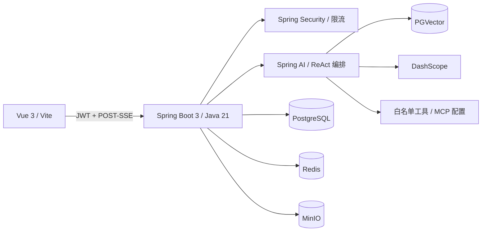

# 心旅 HeartPilot

面向真实关系场景的 AI 关系成长系统：从倾诉问题、知识增强分析，到行动规划、用户确认和持续复盘，形成完整产品闭环。

## 项目来源与定位

本项目基于公开教学项目 [`liyupi/yu-ai-agent`](https://github.com/liyupi/yu-ai-agent)
继续开发。上游提供 Spring AI、RAG、Tool Calling、MCP 和 ReAct/Manus 教学骨架；HeartPilot
主要完成多用户持久化、安全隔离、可恢复任务编排、执行可观测性、关系成长业务闭环和前端重构。

详细差异见 [UPSTREAM_CHANGES.md](UPSTREAM_CHANGES.md)，面试准备见
[INTERVIEW_GUIDE.md](INTERVIEW_GUIDE.md)。项目当前验证关键业务路径和可重复构建，不声明已达到生产级高可用或完成系统化 AI 效果评测。

## 已实现能力

- 用户系统：注册、登录、BCrypt 密码、JWT、普通用户/管理员、资料与情绪状态、会话数据隔离。
- AI 咨询：数据库会话、创建/删除/重命名、POST-SSE 流式输出、停止生成、重新生成、上下文窗口、Token 记录、模型失败重试。
- RAG 知识库：管理员上传 Markdown/TXT/PDF/Word，Tika 解析、清洗、切片、关键词、Embedding、PGVector、引用来源展示。
- 关系报告：结构化分析、风险等级、行动清单、复盘时间、数据库历史、中文 PDF 下载。
- Agent 任务：持久化状态机、SSE 步骤、工具白名单、超时/重试/幂等、工具审计、最大步骤、确认/取消、重启恢复、最终 PDF。
- 关系成长：关系事件、7 天行动计划、每日完成与情绪打卡、每周复盘报告。
- 工程能力：Redis 分布式限流（无 Redis 时自动降级到本地限流）、MinIO/本地双存储、Knife4j、Actuator、Flyway、Docker Compose。
- 全新 Vue 3 响应式界面：首页、AI 咨询、关系报告、行动规划、任务详情、关系档案、成长计划、知识库管理、个人中心。

## 架构



本地默认使用 H2 与本地文件存储，便于直接启动；`prod` 配置使用 PostgreSQL + PGVector、Redis 与 MinIO。

## 快速启动

### 方式一：Docker Compose

1. 复制 `.env.example` 为 `.env`。
2. 至少配置 `DASHSCOPE_API_KEY`；搜索与地图相关能力可继续配置 `SEARCH_API_KEY`、`AMAP_MAPS_API_KEY`。
3. 修改 `JWT_SECRET`、`DATABASE_PASSWORD`、`MINIO_SECRET_KEY` 和管理员初始密码。
4. 启动：

```bash
docker compose up --build
```

访问 `http://localhost:8080`。MinIO 控制台为 `http://localhost:9001`。

### 方式二：本地开发

后端：

```bash
mvn spring-boot:run
```

前端：

```bash
cd heart-pilot-frontend
npm install
npm run dev
```

默认地址：前端 `http://localhost:3001`，后端 `http://localhost:8123/api`，接口文档 `http://localhost:8123/api/swagger-ui.html`。

## Key 迁移

仓库原有的 `.env` 被保留且仍在 `.gitignore` 中。原有 `SEARCH_API_KEY` 的键名和读取方式不变；其余 Key 统一通过环境变量读取，不会写入 Git：

| 用途 | 环境变量 |
|---|---|
| DashScope 对话/Embedding | `DASHSCOPE_API_KEY` |
| 网页搜索 | `SEARCH_API_KEY` |
| 高德地图 MCP | `AMAP_MAPS_API_KEY` |
| Pexels | `PEXELS_API_KEY` |

未配置 DashScope Key 时，非 AI 功能和应用上下文仍可启动，AI/RAG 调用会返回失败状态并保留审计记录。

## 权限与安全

- 注册用户固定为 `USER`，不能通过请求提升权限。
- 管理员由部署变量 `APP_ADMIN_USERNAME` / `APP_ADMIN_PASSWORD` 初始化。
- `/admin/knowledge/**` 仅 `ADMIN` 可访问。
- 所有用户业务查询都附带当前 JWT 用户 ID，避免跨用户读取。
- 产品 Agent 不注册终端命令、任意文件操作或无限制下载工具。
- 生产环境必须替换 Compose 中的示例密码，并通过 Secret 管理系统注入。

## 数据表

`app_user`、`ai_conversation`、`ai_message`、`relationship_profile`、`emotion_report`、`agent_task`、`agent_task_step`、`tool_call_record`、`action_plan`、`action_checkin`、`relationship_event`、`knowledge_document`、`knowledge_chunk`、`generated_file`。

PostgreSQL 初始结构位于 `src/main/resources/db/migration/V1__heart_pilot_schema.sql`。

## 验证

```bash
mvn verify
cd heart-pilot-frontend
npm ci
npm run format:check
npm run build
```

默认测试使用内存 H2，不读取本地开发数据库，也不调用真实 ReAct/MCP 链路。CI 会校验 Java 格式、后端测试与前端生产构建。

## 可见的 Agent 行程业务

创建并运行行动规划任务后，任务详情页会持续展示“分析需求 → 检索展览/餐厅 → 筛选真实地点 → 计算路线 → 生成计划”。每条 Thought、Action、Observation 与 Result 都持久化到 `agent_execution_event`，刷新页面后仍可查看。

配置 `AMAP_MAPS_API_KEY` 后，页面会展示结构化地图卡片、真实 POI、营业时间/当前营业状态、状态核验时间，以及相邻地点的实时步行距离和预计耗时；缺少密钥或外部服务失败时会展示明确的降级原因，不会生成虚构地点。ReAct 默认开启，测试环境关闭；需要同时演示高德 MCP 时使用 `demo` Profile：

```powershell
$env:SPRING_PROFILES_ACTIVE='demo'
mvn spring-boot:run
```

## 工程机制、边界与指标

- 核心列表接口统一使用分页 DTO，业务接口不直接暴露 JPA 实体。
- Agent 任务使用枚举状态机、JPA 乐观锁、Redis 分布式锁、心跳恢复、退避重试和请求幂等键。
- 任务详情只展示高德真实 POI 图片，并用步行轨迹生成带 A/B/C/D 标记的静态路线总览；高德 Key 只在后端使用，不暴露给浏览器。
- Pexels 结构化图片 MCP 仍作为可选工具保留，但不再进入行动规划任务详情或生成“方案氛围图”。
- `REDIS_ENABLED=true` 时缓存热门知识检索与按用户/上下文哈希隔离的模型结果；侧栏“消费成本”按消息展示 Token、估算费用、命中率和缓存节省。缓存 TTL 与模型单价均可通过 `.env` 覆盖。
- 工具超时会中断实际虚拟线程；每次调用保留状态、耗时、幂等键和错误摘要。
- 固定状态机负责可恢复执行；可选 ReAct/MCP 链路只用于白名单内的公开信息核验。
- Prometheus 指标位于 `/api/actuator/prometheus`，包含首字延迟、生成耗时、工具耗时、失败数、幂等命中和 RAG 检索策略。

状态迁移、配置开关和指标名称见 [ENGINEERING.md](ENGINEERING.md)。
