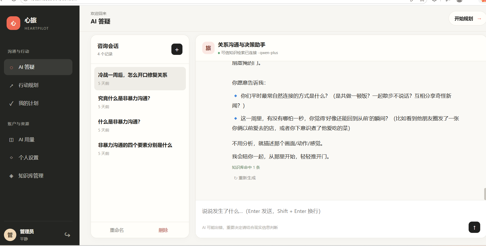
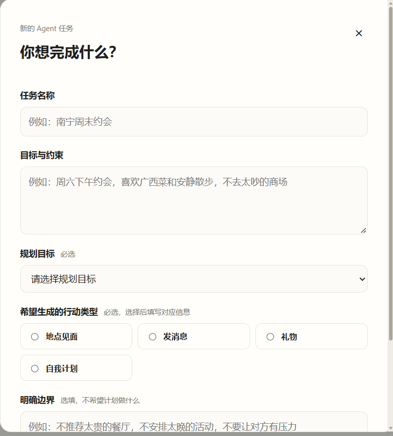
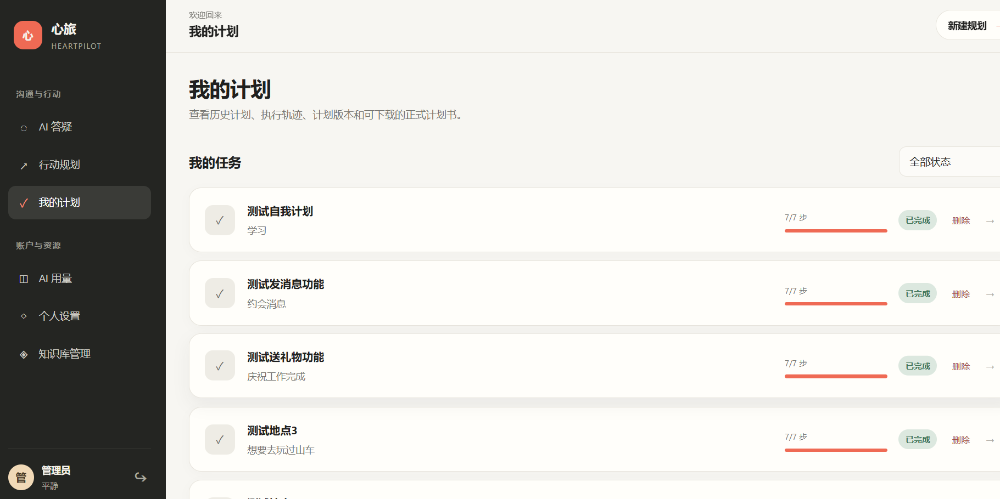
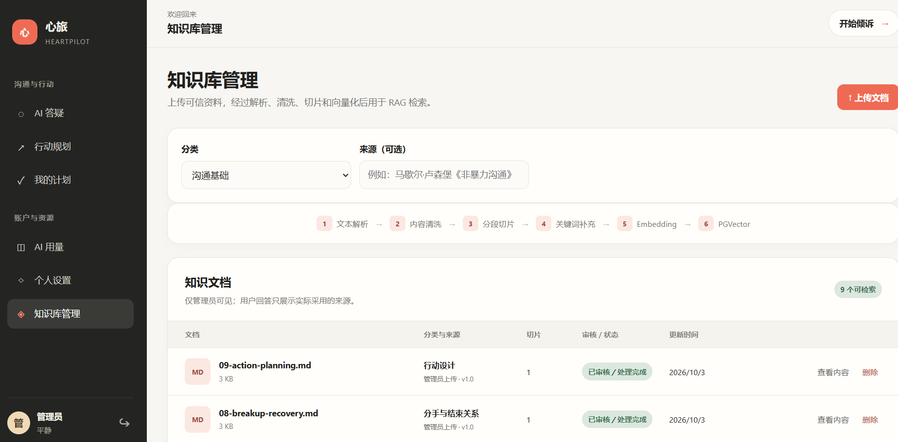

# 心旅 HeartPilot

> 面向关系沟通场景的可恢复 AI 行动编排系统：知识增强答疑 + 多类型行动规划

心旅（HeartPilot）帮助用户在关系沟通困扰中，先把问题说清，再把困扰变成可执行、可确认、可恢复的下一步行动。AI 只给建议，决定权始终在用户手里。

## 目录

- [项目简介](#一项目简介)
- [功能总览](#二功能总览)
- [界面预览](#三界面预览)
- [系统架构](#四系统架构)
- [技术栈](#五技术栈)
- [目录结构](#六目录结构)
- [快速开始](#七快速开始)
- [配置说明](#八配置说明)
- [API 概览](#九api-概览)
- [知识库维护](#十知识库维护)
- [测试与质量评测](#十一测试与质量评测)
- [可观测性](#十二可观测性)
- [部署](#十三部署)
- [安全与数据治理](#十四安全与数据治理)
- [免责声明](#十五免责声明)

## 一、项目简介

心旅是一个面向关系沟通场景的可恢复 AI 行动编排系统，提供两类核心能力：

1. **知识增强答疑**：在安全、连贯的多轮对话里，结合可信知识来源与当前对话事实，给出有依据、可追溯的沟通建议；每一条引用知识都经过引用校验，未经校验的内容不会发送给用户。
2. **多类型行动规划**：让 Agent 根据目标与约束搜集信息、整理方案，在关键步骤等待用户确认后生成正式计划书（含 PDF），并对任务全程做可观测执行与故障恢复。

产品设计遵循三条原则：

- **私密会话隔离**：所有会话与任务按用户维度隔离，仅本人可见。
- **知识库增强**：回答基于审核通过的权威知识文档（RAG），并展示实际采用的来源。
- **高风险安全提醒**：对话先经过安全语境识别；遇到暴力、自伤或人身安全风险时，优先提示寻求现实世界的可信支持，而非继续沟通技巧。

## 二、功能总览

| 功能 | 前端路由 | 说明 |
| --- | --- | --- |
| AI 答疑 | `/consult` | 多轮对话、SSE 流式输出、知识库检索增强、引用校验、重新生成与停止 |
| 行动规划 | `/planning` | 按行动类型创建 Agent 任务，分阶段执行并等待用户确认 |
| 我的计划 | `/plans` | 历史任务列表、进度、状态、执行轨迹、计划版本与 PDF 计划书下载 |
| 任务详情 | `/plans/:id` | Agent 可观测执行：阶段卡片、Thought/Action/Observation 事件流、分支展开 |
| 知识库管理 | `/admin/knowledge` | 管理员上传文档，解析 → 清洗 → 切片 → 关键词补充 → Embedding → PGVector |
| AI 用量 | `/costs` | 查看 AI 调用量与大致的 Token 成本估算 |
| 个人设置 | `/settings` | 昵称、密码等个人资料管理 |
| 注册 / 登录 | `/register` `/login` | JWT 认证，注册即登录 |

支持四类行动规划（`/planning`）：

| 行动类型 | 标识 | 说明 |
| --- | --- | --- |
| 地点见面 | `PLACE_VISIT` | 检索真实餐厅/景点/POI 与路线、距离、预计耗时 |
| 发消息 | `MESSAGE` | 生成定制消息方案 |
| 礼物 | `GIFT_RITUAL` | 联网检索公开商品推荐 |
| 自我计划 | `SELF_PRACTICE` | 生成自我成长/练习计划 |

规划目标（`goalType`）包括：增进连接、修复关系、建立边界、庆祝表达、共同决策、自我成长。

## 三、界面预览

### 1. AI 答疑（`/consult`）

多轮会话 + 知识库增强答疑。左侧会话列表，右侧对话区展示知识库命中状态、参考来源、引用校验结果与 Token 消耗；支持流式输出、重新生成、停止生成。



### 2. 行动规划（`/planning`）

新建 Agent 任务：填写任务名称、目标与约束，选择规划目标与行动类型（地点见面需补充省市、预算、参与人数等约束），并可设置明确边界（不希望计划做什么）。



### 3. 我的计划（`/plans`）

任务列表页：展示任务标题、目标、当前进度（x/7 步）、状态（运行中 / 等待确认 / 已完成等），支持按状态筛选与删除记录。



### 4. 知识库管理（`/admin/knowledge`）

仅管理员可见。上传 Markdown / TXT / PDF / Word 文档（单文件 ≤ 30 MB），按"文本解析 → 内容清洗 → 分段切片 → 关键词补充 → Embedding → PGVector"流水线处理后，通过审核即进入检索池。



## 四、系统架构

### 4.1 总体架构

```
┌──────────────────┐   HTTP / SSE   ┌──────────────────────────────┐
│   Vue 3 前端       │ ─────────────> │   Spring Boot 后端 (:8123)    │
│  localhost:3001   │                │   context-path: /api          │
└──────────────────┘                ├──────────────────────────────┤
                                    │  Auth · Conversation · Agent  │
                                    │  Knowledge · Usage · File     │
                                    └───────┬──────────┬────────────┘
                                            │          │
                              ┌─────────────▼──┐   ┌────▼───────────┐
                              │ PostgreSQL 16   │   │ Redis 7        │
                              │ + PGVector      │   │ 缓存/限流/锁   │
                              ├─────────────────┤   ├───────────────┤
                              │ Flyway 迁移      │   │ MinIO 文件存储 │
                              │ JPA (validate)  │   └───────────────┘
                              └─────────────────┘
```

- 前端开发服务器：`http://localhost:3001`（Vite，端口固定 3001）
- 后端 API：`http://localhost:8123/api`（`SERVER_PORT=8123`，context-path 为 `/api`）
- 生产环境前端端口：`8081`（Docker Compose 中由 `FRONTEND_PORT` 控制）

### 4.2 对话处理链路

用户消息 → **安全语境识别**（真实 / 第三方 / 否定 / 引用 / 假设）→ **问题分流**（`classifier`）→ **当前会话结构化状态更新**（事实、推测、偏好、情绪分开存储）→ **知识检索**（Redis 缓存 → PGVector 向量相似度，阈值 0.58 → 关键词兜底）→ **完整回答生成**（`answer` prompt）→ **固定结构渲染** → **引用校验**（`citation` prompt）。

未经引用校验的模型输出不会发送给前端；SSE 保留为传输协议，但首个 `delta` 已是完成校验的内容。每条助手消息会保存实际 Prompt 版本、知识索引版本、路由、安全语境和引用校验结果。

### 4.3 Agent 任务状态机

任务状态只允许以下核心迁移：

```
WAITING -> RUNNING -> AWAITING_CONFIRMATION -> RUNNING -> SUCCEEDED
```

- 执行失败进入 `RETRY_WAIT`，达到退避时间后由恢复扫描重新执行；超过最大重试次数进入 `FAILED`。
- 取消进入 `CANCELLED`；终态任务不能再次进入运行态。
- 失败任务可在任务详情页手动"重新执行"。

### 4.4 可恢复执行机制

- **JPA `@Version` 乐观锁**：防止并发覆盖任务状态。
- **Redis `SET NX + TTL` 互斥租约锁**：多实例下保证同一任务只有一个执行者，Lua 脚本校验锁所有者后再续租、释放；Redis 不可用时降级为单实例本地锁。
- **工具超时中断**：工具使用 `Future#get(timeout)`，超时调用 `cancel(true)` 中断实际执行线程。
- **幂等创建**：`Idempotency-Key` 与用户 ID 组成唯一约束，重复创建返回原任务。
- **心跳与恢复扫描**：定时扫描恢复服务重启或实例失联遗留的 `RUNNING` 任务。

### 4.5 Agent 与 MCP 边界

- 固定状态机负责可恢复业务流程；ReAct 默认参与公开信息核验，调用失败时自动降级到结构化地图与网页检索。
- 工具白名单仅包含网页搜索、终止工具，以及名称匹配地图、路线、POI 检索的 MCP 工具（高德 MCP 由 `MCP_ENABLED=true` 启用）；终端、任意文件写入等工具已移除。
- 地点配图由应用内普通图片服务按需提供，不属于 Agent 工具链。
- 任务详情页展示 Agent 阶段、工具观察、真实地点、路线距离、预计耗时与降级原因；外部能力（AI 对话、网页搜索、地图）状态不可用时明确显示降级，不编造地点、商品和距离。

## 五、技术栈

| 层次 | 技术 | 说明 |
| --- | --- | --- |
| 后端 | Java 21 + Spring Boot 3.4.4 | Web、Security、Validation、JPA、Actuator |
| AI | Spring AI / Spring AI Alibaba | DashScope（qwen-plus / text-embedding-v3）、Ollama（默认关闭） |
| Agent | Spring AI MCP Client | 高德 MCP 工具链（可选启用） |
| 数据库 | PostgreSQL 16 + PGVector | 业务数据与向量检索，Flyway 管理迁移（V1~V13） |
| 缓存 | Redis 7 | 缓存、分布式锁、限流 |
| 存储 | MinIO / 本地文件 | 文件存储抽象，生产默认 MinIO |
| 文档处理 | Apache Tika 3、PDFBox | 知识文档解析（Markdown / TXT / PDF / Word） |
| PDF 生成 | iText 9 | 正式计划书导出 |
| 认证 | JWT（jjwt 0.12） | 登录/注册签发访问令牌，Spring Security 过滤链 |
| 文档与监控 | Knife4j（OpenAPI3）、Micrometer + Prometheus | API 文档与可观测指标 |
| 测试 | H2 + Testcontainers（PostgreSQL） | 单测、集成测试、固定评测集 |
| 前端 | Vue 3 + TypeScript + Vite 8 | Vue Router 4、Axios、SSE 流式消费 |
| 部署 | Docker Compose | PostgreSQL / Redis / MinIO / backend / frontend 五服务 |

## 六、目录结构

```
heart-pilot/
├── .env.example                 # 环境变量样例（复制为 .env 后填写）
├── docker-compose.yml           # 本地/生产基础设施编排
├── DEPLOY.md                    # 服务器部署说明
├── ENGINEERING.md               # 工程设计与边界说明
├── SECURITY-DATA.md             # 数据与密钥治理说明
├── deploy.cmd                   # Windows 一键部署入口
├── docs/
│   └── screenshots/             # README 配图
├── heart-pilot-backend/         # Spring Boot 后端
│   └── src/main/
│       ├── java/com/heartpilot/
│       │   ├── common/          # 通用返回、异常、健康检查
│       │   ├── config/          # 安全、限流、缓存等配置
│       │   ├── infrastructure/  # AI 工具链、RAG 检索
│       │   ├── security/        # JWT 与当前用户
│       │   └── module/          # auth / conversation / agent / knowledge / file / usage / user
│       └── resources/
│           ├── db/migration/    # Flyway SQL（V1~V13）
│           ├── prompts/         # classifier / answer / citation / safety 提示词
│           └── application*.yml # 开发 / demo / prod / knowledge-reindex 配置
├── heart-pilot-frontend/        # Vue 3 前端
│   └── src/
│       ├── api/                 # axios 封装与 SSE
│       ├── components/          # AppShell / StructuredText 等
│       ├── router/              # 路由与鉴权守卫
│       ├── stores/              # 认证状态
│       └── views/               # Home / Consult / Plans / TaskDetail / Knowledge 等
├── knowledge/                   # 知识库规范源（Git 管理，*.md + front matter）
├── knowledge-test-data/         # 知识库上传功能测试数据与指南
├── eval/                        # 固定对话评测集与基线
└── scripts/                     # 部署、索引重建、评测脚本（PowerShell）
```

## 七、快速开始

### 7.1 环境要求

- JDK 21（后端编译运行）
- Maven（使用项目自带 `mvnw.cmd` 亦可）
- Node.js 20+（前端）
- Docker + Docker Compose（本地基础设施）
- 可选：DashScope API Key（对话与向量化模型）、高德 Maps API Key（地点见面检索）

### 7.2 启动基础设施

项目根目录执行（会加载 `docker-compose.override.yml`，仅在本机回环地址暴露 5432 / 6379 / 9000 / 9001，供本地后端连接）：

```bash
docker compose up -d
```

启动三个基础服务：PostgreSQL（pgvector/pgvector:pg16）、Redis 7、MinIO。首次启动会自动完成健康检查与数据卷初始化。

### 7.3 配置环境变量

```bash
# 复制样例并填写
copy .env.example .env
```

至少修改 `JWT_SECRET`、`DATABASE_PASSWORD`、`MINIO_ACCESS_KEY`、`MINIO_SECRET_KEY`、`APP_ADMIN_PASSWORD`，并填写实际使用的 API Key（`DASHSCOPE_API_KEY`、`SEARCH_API_KEY`、`AMAP_MAPS_API_KEY`）。`.env` 已被 `.gitignore` 忽略，不要提交。

### 7.4 启动后端

```powershell
cd heart-pilot-backend
.\mvnw.cmd spring-boot:run
```

后端监听 `8123`，API 前缀 `/api`，健康检查：`http://localhost:8123/api/health`。

> 数据库迁移由 Flyway 自动执行（`ddl-auto=validate`）；本地未配置 DashScope Key 时 `aiEnabled=false`，知识检索自动降级为关键词匹配，对话链路仍可用。

### 7.5 启动前端

```powershell
cd heart-pilot-frontend
npm ci
npm run dev
```

前端监听 `http://localhost:3001`（Vite `strictPort: true`，端口固定）。打开后注册账号即可使用；知识库管理等管理员接口需 ADMIN 角色（管理员账号在部署配置 `APP_ADMIN_USERNAME` / `APP_ADMIN_PASSWORD` 中设置）。

### 7.6 可用页面

| 地址 | 内容 |
| --- | --- |
| `http://localhost:3001/` | 首页 / 落地页 |
| `http://localhost:3001/consult` | AI 答疑 |
| `http://localhost:3001/planning` | 行动规划 |
| `http://localhost:3001/plans` | 我的计划 |
| `http://localhost:3001/plans/:id` | 任务详情（Agent 执行轨迹） |
| `http://localhost:3001/admin/knowledge` | 知识库管理（ADMIN） |
| `http://localhost:3001/costs` | AI 用量 |
| `http://localhost:3001/settings` | 个人设置 |
| `http://localhost:8123/api/swagger-ui.html` | 后端 API 文档（Knife4j） |

## 八、配置说明

`.env.example` 中的关键配置项：

| 配置项 | 默认值 | 说明 |
| --- | --- | --- |
| `DASHSCOPE_API_KEY` | 空 | 对话与 Embedding 模型 API Key（未配置则降级关键词检索） |
| `SEARCH_API_KEY` | 空 | 送礼链路网页搜索兜底（searchapi.io） |
| `AMAP_MAPS_API_KEY` | 空 | 高德 MCP 地图检索 |
| `MCP_ENABLED` | `false` | 是否启用 MCP 客户端（demo Profile 同时开启 ReAct） |
| `AGENT_REACT_ENABLED` | `true` | Agent ReAct 链路开关 |
| `JWT_SECRET` | 开发默认 | 访问令牌签名密钥（生产必须更换，≥ 32 字符） |
| `APP_ADMIN_USERNAME` / `APP_ADMIN_PASSWORD` | `admin` / 占位 | 管理员账号 |
| `FRONTEND_PORT` | `8081` | 生产前端对外端口 |
| `CORS_ALLOWED_ORIGINS` | 本地 3001/5173 | 允许的前端来源 |
| `REDIS_ENABLED` | `true` | Redis 缓存 / 限流 / 分布式锁开关 |
| `KNOWLEDGE_CACHE_TTL_MINUTES` | `30` | 知识检索缓存有效期 |
| `MODEL_CACHE_TTL_MINUTES` | `60` | 模型结果缓存有效期 |
| `AI_INPUT/OUTPUT_CNY_PER_MILLION_TOKENS` | 0.8 / 2.0 | 用量页成本估算单价 |
| `MINIO_*` | 本地 9000 | 对象存储连接 |
| `SERVER_PORT` | `8123` | 后端端口（application.yml） |

## 九、API 概览

后端统一前缀 `/api`，除注册 / 登录外均需 `Authorization: Bearer <JWT>`。

| 模块 | 方法与路径 | 说明 |
| --- | --- | --- |
| 认证 | `POST /auth/register` | 注册并自动登录 |
| | `POST /auth/login` | 登录，返回 JWT 与用户信息 |
| 会话 | `GET /conversations` | 当前用户会话列表（分页） |
| | `POST /conversations` | 创建会话 |
| | `PATCH /conversations/{id}` | 重命名会话 |
| | `DELETE /conversations/{id}` | 删除会话（级联消息） |
| | `GET /conversations/{id}/messages` | 历史消息（分页） |
| | `POST /conversations/{id}/messages/stream` | 发送消息，SSE 流式回答 |
| | `POST /conversations/{id}/messages/{mid}/regenerate` | 重新生成 |
| | `POST /conversations/{id}/stop` | 停止流式生成 |
| Agent 任务 | `GET /agent-tasks/capabilities` | 外部能力运行时状态 |
| | `GET /agent-tasks` | 任务列表（分页） |
| | `POST /agent-tasks` | 创建任务（Idempotency-Key 幂等） |
| | `GET /agent-tasks/{id}` | 任务详情（步骤、工具调用、事件、PDF） |
| | `GET /agent-tasks/{id}/execution-events` | 执行事件时间线 |
| | `GET /agent-tasks/{id}/plan` | 计划产物与版本历史 |
| | 确认 / 取消 / 重试 / 删除 | 任务生命周期管理 |
| 知识库 | `GET /admin/knowledge` | 文档列表（ADMIN） |
| | `POST /admin/knowledge/documents` | 上传文档（同步解析切片向量化） |
| | `GET /admin/knowledge/documents/{id}/content` | 查看切片内容 |
| | `PATCH /admin/knowledge/documents/{id}/approve` | 审核通过进入检索池 |
| | `DELETE /admin/knowledge/documents/{id}` | 删除并级联清理向量/文件 |
| 用户 | 用户信息 / 更新资料 | `module/user` |
| 用量 | `GET /usage/...` | AI 用量与成本统计 |
| 文件 | 上传 / 下载 | `module/file`（本地或 MinIO） |
| 健康 | `GET /health` | 健康检查 |
| 文档 | `GET /v3/api-docs` | OpenAPI 文档（Knife4j UI） |
| 监控 | `GET /actuator/health、metrics、prometheus` | 可观测指标 |

## 十、知识库维护

`knowledge/*.md` 是知识内容的规范仓库源。每个文件必须在 front matter 中声明：

- 必填：`document_id`、`title`、`category`（白名单 8 类：沟通基础、冲突与修复、边界与同意、关系阶段、分手与结束关系、数字沟通、行动设计、风险与安全）、`source`、`version`、`confidence`（HIGH / MEDIUM / LOW / UNVERIFIED）
- 可选：`source_url`、`review_status`（DRAFT / IN_REVIEW / APPROVED / REJECTED）、`applicable_scenario`、`relationship_stage`、`risk_tags`

修改 Markdown 后执行全量索引重建：

```powershell
.\scripts\rebuild-knowledge-index.ps1 -UserId 1
```

脚本会先强校验所有 Markdown（缺失必填字段即失败），再以 `knowledge-reindex` Profile 启动后端完成全量重建。索引版本由全部源文件内容哈希确定，进入检索与回答缓存键；文档审核通过时 `indexVersion` 更新，缓存自动失效，"通过即生效"。

管理员也可在 `/admin/knowledge` 上传文档（手动上传路径只走 Tika 抽正文，不解析 front matter）。文档状态机：`UPLOADED → PROCESSING → READY`（失败置 `FAILED`）；切片规则为 1200 字符/片、120 字符重叠；检索准入要求 `READY` 且 `APPROVED`；检索三级策略为 Redis 缓存命中 → PGVector 向量相似度（阈值 0.58）→ 关键词包含兜底。

## 十一、测试与质量评测

### 11.1 自动化验证

```bash
cd heart-pilot-backend
mvn verify        # 单测/集成测试 + Spotless 格式检查 + 构建

cd ../heart-pilot-frontend
npm ci
npm run format:check
npm run build
```

测试环境使用内存 H2，不读取本地开发数据库，也不调用真实 MCP / ReAct 链路。

### 11.2 固定对话评测（离线回归门槛）

固定样本、指标定义与改造前基线位于 `eval/`：

```powershell
.\scripts\run-conversation-eval.ps1
```

评测会先回放旧关键词规则以复现基线，再运行当前安全与引用校验，报告以下指标：

| 指标 | 定义 |
| --- | --- |
| 引用覆盖率 | 需要知识依据的结论中，带通过校验引用的比例 |
| 虚假引用率 | 不存在、证据等级不足或内容不支持的引用数 / 总引用数 |
| 无结果降级成功率 | 没有可用来源时，删除引用并明确说明依据不足的样本比例 |
| 高风险召回率 | 真实或第三方高风险样本进入安全流程的比例 |
| 高风险误报率 | 否定、虚构、假设和普通样本被错误判为安全流程的比例 |

固定集是离线回归门槛，不替代真实模型与人工评审。

## 十二、可观测性

启动后可通过 `/api/actuator/prometheus` 或 `/api/actuator/metrics/{name}` 查看：

- `heartpilot.chat.time_to_first_token`：流式对话首字延迟
- `heartpilot.chat.generation.duration`：生成总耗时（按结果分类）
- `heartpilot.chat.active_generations`：当前生成数
- `heartpilot.agent.tool.duration` / `heartpilot.agent.tool.failures`：工具耗时与失败
- `heartpilot.agent.tool.idempotency_hits`：工具幂等命中次数
- `heartpilot.agent.task.transitions`：任务状态迁移次数
- `heartpilot.rag.retrieval`：向量检索与关键词降级次数
- `heartpilot.chat.route`：问题分流结果
- `heartpilot.chat.safety_decision`：安全动作与语境
- `heartpilot.chat.citation_validation` / `citations` / `citation_coverage`：引用校验与覆盖

## 十三、部署

一键部署到服务器（本机编译 Jar 与前端 `dist`，服务器仅用 Docker Compose 运行产物）：

```powershell
.\deploy.cmd
# 指定 SSH 用户与私钥
.\deploy.cmd -RemoteUser ubuntu -IdentityFile C:\keys\server.pem
# 已有部署包时跳过构建
.\deploy.cmd -SkipBuild
```

部署细节见 [DEPLOY.md](DEPLOY.md)：脚本先执行后端 `clean verify`、前端格式检查与生产构建，任一步失败不会上传；PostgreSQL、Redis、MinIO 使用命名卷，更新容器不清空数据。

## 十四、安全与数据治理

- `.env`、`data/`、`legacy-data/`、构建产物与用户生成文件不得提交（`.gitignore`）。
- `demo-data/` 只保存人工编写、不可关联真实个人的固定 JSON。
- 提交前检查 `git status` 并使用密钥扫描工具检查当前内容与完整历史；历史中的真实凭据应在团队确认后轮换，具体见 [SECURITY-DATA.md](SECURITY-DATA.md)。
- 对话安全：安全语境识别 + 问题分流 + 引用校验，未经校验的内容不下发；会话状态只在当前会话内保存，系统不建立跨会话心理画像。

## 十五、免责声明

AI 建议不替代医疗、心理、法律等专业服务。涉及现实人身危险时，请优先离开危险环境并寻求当地紧急或专业援助。
